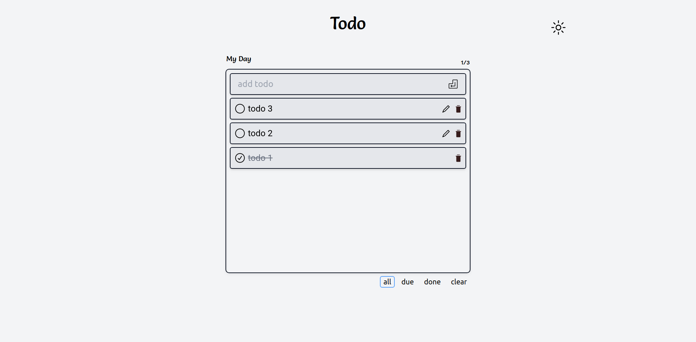

<h1 align="center">Todo <code>1.5</code></h1>

> A TODO application which build by React

## Technologies
Usage  | tech
------------- | -------------
UI  | React, tailwind, Figma
Utils  | shortid
database | local storage
Dev env | Vite, eslint, postcss
production | netlify

[figma UI](https://www.figma.com/file/pooOEE9h3Hg12p5C5wDGUv/Todo?node-id=0%3A1)
[Go Live](https://stoic-darwin-27d6ba.netlify.app/) > refresh your page if link does not work.

## Upcoming Features
 - Add Todo list
 - Todo List viewer page